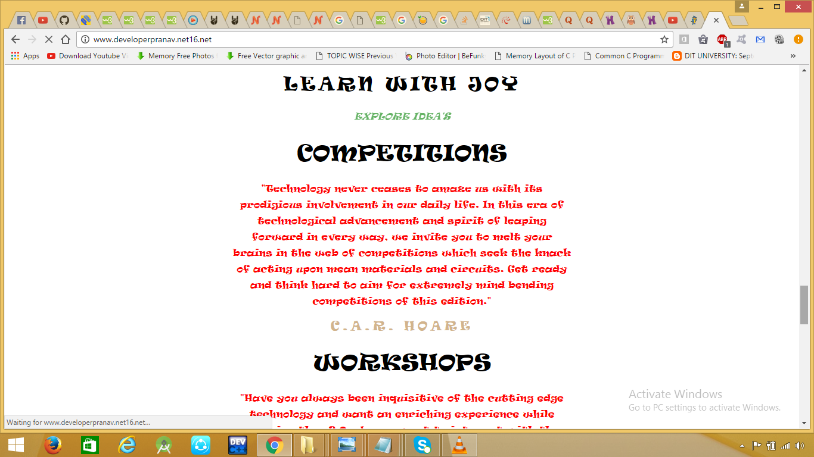

# DIT_FEST

# 1301051070– Pranav Adarsh 
# 1301051096 – Shivendu Agarwal  
# 1301051086 – Ruchi Kumari 
# 1301051081 – Richa Joshi 
# Under the guidance of 
# Mr. Kushal Gupta, Assistant Professor 
# Department of Computer Science 
 

This project is based on the college fest which is actually a website made in php so that each one can get update of event in a college. This includes college schedule events, sponsors of event online and assign student for event. In this we can update and manage the events.
 
 
 
We can register, login for admin and students, view events, add .We can login with the help of email id / phone no and password. All events can be added and modified. Admin can upload information related to the event. Students and participant can view the uploaded information. 
 
 
 
 
Event organizer creates schedule for the event and assign to the admin to update. Student can view the events and registered students can register online for events. All the information which are needed will be given to the student as well as to the staff member accordingly. 
 
 
 
 
 
 
 
 
 
 
 
 
